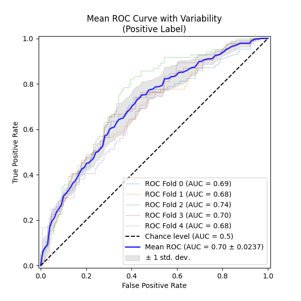

# **text-classification-api**  

Ce dépôt contient une **API de classification de texte** basée sur un modèle de Machine Learning.  
Des propositions sont faites pour des modèles utilisant du Deep Learning ou des appels à des LLMs.  
L'API est développée avec **FastAPI**, avec des routes de métriques pour **Prometheus** et **Grafana**,  
et un déploiement possible via **Docker**.  

---

## **Choix des modèles et justification**  

Plusieurs solutions ont été envisagées :

| Modèle | Type             | Avantages | Inconvénients |
|--------|------------------|--------------------------------------------------------|---------------------------------------------------------------------------------------------------------------|
| **SVM + TF-IDF** | Machine Learning | Rapide, léger, peu de dépendances | Performances limitées sur du texte complexe |
| **CamemBERT** | Deep Learning    | Performant sur le français, supporte des phrases longues | Nécessite une quantité importante de RAM et un GPU |
| **LLM (Large Language Models)** | LLM              | Très performant sur une grande variété de tâches | Nécessite un déploiement interne ou une API externe (OpenAI, Anthropic, Mistral, etc.) |

### **Compromis**  

- **SVM + TF-IDF** : Facile à déployer, idéal pour des API légères. Permet un passage à l'échelle sur une infrastructure CPU.  
- **CamemBERT** : Spécialisé en français, adapté aux phrases complexes. Plus difficile à mettre à l'échelle sans infrastructure adaptée.  
- **LLM** : Excellent sur des tâches avancées, mais très gourmand en ressources. Requiert un investissement conséquent pour un bénéfice encore à démontrer selon la tâche cible.  

---

## **Méthodologie**  

Plusieurs approches ont été envisagées pour résoudre le problème :

### **Approche SVM + TF-IDF**  

Approche basée sur la littérature récente, reposant sur des méthodes de Machine Learning éprouvées, mais nécessitant un travail approfondi de feature engineering.  

Compte tenu des contraintes de temps, le feature engineering a été limité aux actions suivantes :  
- **Consolidation des données** : résolution des conflits entre annotateurs par vote majoritaire.  
- **Sélection des caractéristiques (features) TF-IDF** : utilisation des fonctions standards de `sklearn` (approche naïve mais efficace).  

Le modèle a été sélectionné en suivant les recommandations de **Wahba et al. (2022)** [(lien)](https://arxiv.org/abs/2211.02563v1).  
#### **Evaluation**
- Deux approches ont été mise en oeuvre :  
  - **Séparation stricte des jeux de données** : `train`, `test` et `validation` pour éviter le surapprentissage.  
  - **Validation croisée (K-Fold)** : permet d'obtenir une estimation statistique plus robuste des performances du modèle.

##### Resultats :

Scikit-learn classification report : 
```
               precision    recall  f1-score   support

           0       0.72      0.83      0.77       161
           1       0.67      0.51      0.58       106

    accuracy                           0.70       267
   macro avg       0.69      0.67      0.67       267
weighted avg       0.70      0.70      0.70       267
```
#### **Pistes d'amélioration**  

- **Optimisation** : Recherche des meilleurs hyperparamètres via `GridSearch`.  
- **Amélioration du prétraitement des données** : `TfidfVectorizer` ne supporte que les stop words en anglais. Une meilleure tokenisation via `nltk` pourrait améliorer les performances.  
- **Intervalle de confiance sur les métriques** : Fournir un **intervalle de confiance** sur les résultats au lieu d'une simple moyenne.  
- **Optimisation du seuil de classification** : Étudier la courbe **ROC** pour trouver un équilibre optimal entre faux positifs et faux négatifs.  

---

### **Approche Fine-tuning de CamemBERT**  

Approche basée sur les avancées récentes en traitement automatique des langues pour le français.  
[CamemBERT 2.0](https://arxiv.org/abs/2411.08868) est un modèle pré-entraîné performant que l'on peut adapter à une tâche de classification binaire via un fine-tuning.  

#### **Limites de cette approche**  

- **Taille du dataset** : Le volume de données est insuffisant pour un fine-tuning efficace.  
- **Ressources de calcul** : L'entraînement (et l'inférence sans optimisation CPU) nécessite un GPU, ce qui peut être une contrainte forte.  

Un script de fine-tuning adapté d'un projet précédent est néanmoins fourni pour expérimentation.  

#### **Proposition d’augmentation de données**  

Une approche expérimentale consiste à générer des **données synthétiques** via des **LLMs**.  

Trois stratégies de génération sont envisagées :  

1. **Génération d’exemples positifs (OK)** : Générer du texte similaire à des exemples conformes via un LLM, en filtrant ceux trop proches du corpus initial (via un score de similarité type `E5` ou `BGE-M3`).  
2. **Génération d’exemples négatifs (NOK)** : Même approche, mais pour les exemples non conformes.  
3. **Validation par LLM ("LLM as a judge")** : Utilisation d’un prompt précis pour évaluer objectivement la qualité des données générées.  

Bien que prometteuse, cette approche comporte des **biais** liés à la diversité du corpus initial et aux modèles générateurs eux-mêmes.  

---

## **Utilisation du Makefile**  

Le projet propose un **Makefile** pour simplifier les commandes courantes.  

### **Entraînement du modèle**  
```sh
make train
```
Lance l’entraînement du modèle avec `src/training/train_sklearn_pipeline.py`.  

---

### **Démarrer l’API FastAPI**  
```sh
make run
```
Démarre l’API avec **Uvicorn**, en mode **reload** (utile en développement).  
L’API sera accessible à **http://127.0.0.1:8000**.  

---

### **Exécuter les tests End-to-End**  
```sh
make e2e-test
```
Exécute les tests E2E avec **pytest** (`tests/e2e_test/test_api.py`).  

---

### **Construire et exécuter l’image Docker**  

```sh
make docker-build
make docker-run
```
Lance l’API dans un conteneur Docker sur le port `8000`.  

---

## **Installation**  

### **Installation depuis le dépôt**  

#### **Pré-requis**  
- **Python 3.10** ou plus récent  
- **pip**  
- **Docker**  

#### **Étapes**  

1. Cloner le dépôt  
   ```sh
   git clone https://github.com/votre-utilisateur/text-classification-api.git
   cd text-classification-api
   ```

2. Créer un environnement virtuel et installer les dépendances  
   ```sh
   python -m venv venv
   source venv/bin/activate  # Windows: venv\Scripts\activate
   pip install -r requirements.txt
   ```

---

### **Installation avec Docker**  

1. **Construire l’image Docker**  
   ```sh
   docker build -t text-classifier-api -f deployment/Dockerfile .
   ```

2. **Lancer l’API**  
   ```sh
   docker run -p 8000:8000 text-classifier-api
   ```

3. **Vérifier l’API**  
   ```sh
   curl -X GET "http://127.0.0.1:8000/health/"
   ```

---

## **Tests**  

Le projet utilise **pytest** pour les tests unitaires et d’intégration.  

### **Exécuter tous les tests**  
```sh
pytest tests/
```

### **Tester l’API avec cURL**  
```sh
curl -X POST "http://127.0.0.1:8000/predict/" -H "Content-Type: application/json" -d '{"text": "Exemple"}'
```

---

## **Travaux futurs**  

Le projet pourrait évoluer vers une approche hybride, combinant **plusieurs modèles** avec un vote majoritaire.  

---

## **Références**  

- **Antoun et al. (2024)** : [CamemBERT 2.0](https://arxiv.org/abs/2411.08868)  
- **Wahba et al. (2022)** : [Comparaison SVM vs LLM](https://arxiv.org/abs/2211.02563v1)